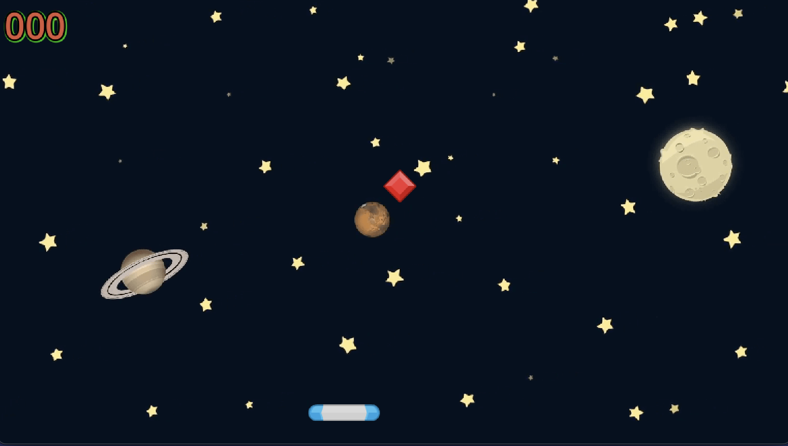

# 💎 Gem Catcher Game

## 🪙 Overview
**Gem Catcher** is a fast-paced desktop game built with **Godot Engine**.  
Catch falling gems, avoid hazards, collect power-ups, and aim for the highest score!

## 🎮 Gameplay
- Move your basket left or right to catch gems  
- Avoid bombs and rocks  
- Collect combos and activate power-ups  
- The game ends when you lose a gem

## 🕹️ Controls
- **← / A** – Move left  
- **→ / D** – Move right  

## ✨ Features
- Built entirely in **Godot**  
- Smooth and responsive controls  
- Different gem types and rarities  
- Power-ups and combo scoring  
- Local high score saving  

## ⚙️ Installation & Running
1. Download or clone this repository  
2. Open the folder in **Godot Engine (v4.x recommended)**  
3. Click **Run** ▶️ to start the game  
4. To export, go to **Project → Export → Desktop (Windows/Linux/Mac)**
